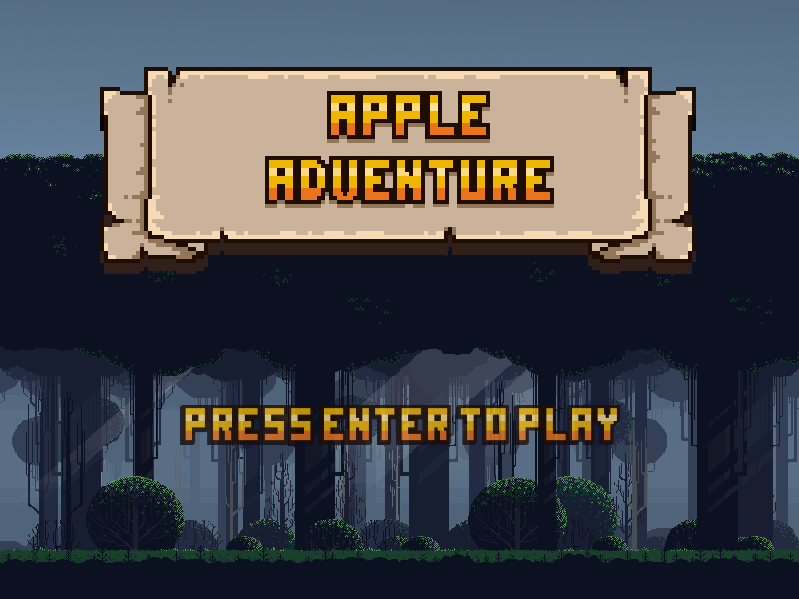

# Apple Adventure

<div align='center'>
    <div>
    An old browser game project made with <a target='_blank' href='https://phaser.io/phaser3'>Phaser 3</a> that has now been ported (poorly) to run (poorly) on <a target='_blank' href='https://www.electronjs.org/'>Electron</a>.
    </div>
    <br>
    
</div>

## Prerequisites
- [npm](https://www.npmjs.com/)

## Building and running
```
npm install
npm start
```